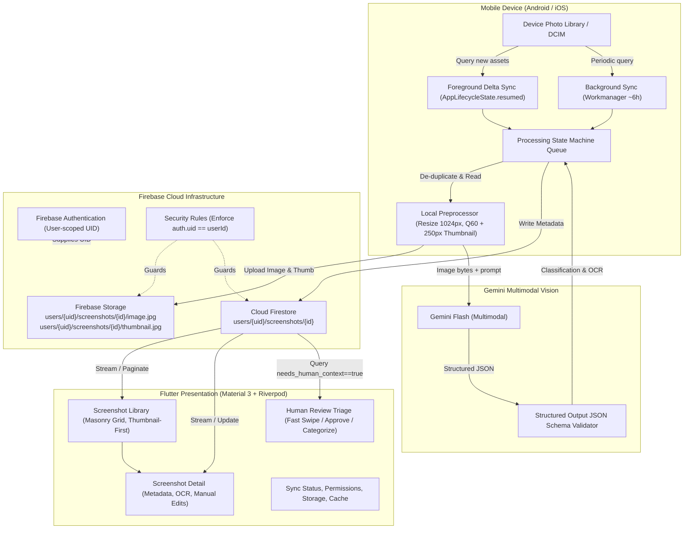

# Project Sift — System Architecture Blueprint

## 1. System Overview & Architecture Diagram

Project Sift is an AI-powered screenshot intelligence and organization system built on Flutter, Firebase, and Gemini Multimodal Vision.

The end-to-end dataflow pipeline is depicted below:



---

## 2. Directory Structure

```text
project_sift/
├── android/                         # Android native config (Permissions, Gradle, Scoped Storage)
├── ios/                             # iOS native config (Photo Library Permissions, Podfile)
├── assets/                          # Design assets, icons, typography
│   ├── icons/
│   └── images/
│
├── lib/
│   ├── app/
│   │   ├── app.dart                 # Root MaterialApp, Riverpod ProviderScope
│   │   ├── router.dart              # Declarative AppRouter
│   │   └── theme/
│   │       ├── app_colors.dart      # Semantic color palette (Dark/Light M3)
│   │       ├── app_theme.dart       # ThemeData builder
│   │       ├── app_typography.dart  # Typography scales
│   │       └── app_spacing.dart     # Spacing, padding & radius tokens
│   │
│   ├── core/
│   │   ├── constants/               # Global constants & broad categories
│   │   ├── errors/                  # Typed domain failures & exceptions
│   │   ├── extensions/              # DateTime, String, Context utility extensions
│   │   ├── logging/                 # Structured Logger (disables verbose in release)
│   │   └── utils/                   # Cryptographic hashing & image utilities
│   │
│   ├── features/
│   │   ├── auth/
│   │   │   ├── data/                # FirebaseAuthRepository
│   │   │   ├── domain/              # User entity & auth state
│   │   │   └── providers/           # authStateProvider
│   │   │
│   │   ├── screenshots/
│   │   │   ├── domain/
│   │   │   │   ├── entities/        # ScreenshotItem, ProcessingStatus, ReviewStatus
│   │   │   │   └── repositories/    # ScreenshotRepository interface
│   │   │   ├── data/
│   │   │   │   ├── models/          # FirestoreScreenshotDTO, LocalAssetDTO
│   │   │   │   └── repositories/    # FirestoreScreenshotRepositoryImpl
│   │   │   ├── presentation/
│   │   │   │   ├── controllers/     # ScreenshotListController, DetailController
│   │   │   │   ├── screens/         # HomeScreen, ScreenshotDetailScreen
│   │   │   │   └── widgets/         # MasonryGrid, ThumbnailTile, CategoryChips
│   │   │   └── providers/           # screenshotListProvider, filteredScreenshotsProvider
│   │   │
│   │   ├── review/
│   │   │   ├── presentation/
│   │   │   │   ├── controllers/     # ReviewQueueController
│   │   │   │   ├── screens/         # ReviewQueueScreen
│   │   │   │   └── widgets/         # TriageCard, CategoryPickerSheet, TagEditor
│   │   │   └── providers/           # reviewQueueProvider
│   │   │
│   │   ├── search/
│   │   │   ├── presentation/        # SearchFilterBar, DateRangeSelector
│   │   │   └── providers/           # searchFilterProvider
│   │   │
│   │   └── settings/
│   │       ├── presentation/        # SettingsScreen, CacheManagementTile
│   │       └── providers/           # syncSettingsProvider
│   │
│   ├── infrastructure/
│   │   ├── ai/
│   │   │   ├── screenshot_analyzer.dart    # Abstract ScreenshotAnalyzer
│   │   │   ├── gemini_analyzer_impl.dart   # Gemini multimodal vision implementation
│   │   │   ├── ai_response_parser.dart     # Resilient JSON schema parser
│   │   │   └── models/                     # ScreenshotAnalysis model
│   │   │
│   │   ├── background/
│   │   │   ├── background_service.dart     # Workmanager callback dispatcher
│   │   │   └── tasks/                      # PeriodicSyncTask
│   │   │
│   │   ├── firebase/
│   │   │   ├── firebase_config.dart        # Core initialization & emulator hookup
│   │   │   ├── firestore_service.dart      # Firestore client wrapper
│   │   │   └── storage_service.dart        # Firebase Storage client wrapper
│   │   │
│   │   └── media/
│   │       ├── screenshot_source.dart      # photo_manager integration
│   │       ├── local_preprocessor.dart     # Image resizing & thumbnail generation
│   │       ├── deduplication_service.dart  # Hash & metadata fingerprinting
│   │       └── processing_queue.dart       # Bounded-concurrency processing pipeline
│   │
│   └── main.dart                           # Entrypoint, emulator configuration
│
├── test/
│   ├── unit/
│   │   ├── deduplication_test.dart
│   │   ├── ai_response_parser_test.dart
│   │   ├── processing_queue_test.dart
│   │   └── category_normalization_test.dart
│   └── widget/
│       ├── masonry_grid_test.dart
│       ├── review_card_test.dart
│       └── screenshot_detail_test.dart
│
├── firestore.rules                         # Security rules for Firestore
├── firestore.indexes.json                  # Compound indexes for filtering
├── storage.rules                           # Security rules for Cloud Storage
├── firebase.json                           # Firebase CLI configuration
├── pubspec.yaml                            # Dependencies & assets
└── README.md
```

---

## 3. Dependency Plan

| Package | Category | Version Target | Rationale |
| :--- | :--- | :--- | :--- |
| `flutter_riverpod` | State Management | `^2.6.1` | Robust, reactive, testable state management without boilerplate |
| `firebase_core` | Firebase Foundation | `^3.8.1` | Core Firebase bindings |
| `firebase_auth` | Authentication | `^5.3.4` | Guaranteed user-scoped isolation for all Firestore/Storage paths |
| `cloud_firestore` | Cloud Database | `^5.6.0` | Primary metadata store with realtime streams & offline caching |
| `firebase_storage` | Cloud Object Storage | `^12.3.7` | Secure storage for compressed screenshots and thumbnails |
| `photo_manager` | Media Discovery | `^3.6.4` | Granular, performant, paginated gallery & screenshot asset access |
| `flutter_image_compress`| Local Preprocessor | `^2.3.0` | High-performance native image resizing and JPEG compression |
| `path_provider` | File Utilities | `^2.1.5` | Application sandbox directories for temporary cached thumbnails |
| `crypto` | Deduplication | `^3.0.6` | SHA-256 asset content hashing for bulletproof deduplication |
| `workmanager` | Background Processing| `^0.5.2` | Android WorkManager & iOS Background Task orchestration |
| `google_generative_ai` | AI Multimodal Vision| `^0.4.6` | Official Gemini API SDK supporting multimodal prompt & structured JSON |
| `flutter_staggered_grid_view` | UI Layout | `^0.7.0` | High-performance masonry layout for responsive screenshot display |
| `cached_network_image` | Image Caching | `^3.4.1` | Memory-efficient disk-backed thumbnail cache |

---

## 4. Firebase Data Model (Cloud Firestore)

### Collection Hierarchy
```text
users/{userId}
  ├── profile data
  └── screenshots/{screenshotId}
```

### Document Schema (`users/{userId}/screenshots/{screenshotId}`)
```json
{
  "id": "sc_7f8a91b2c3d4",
  "title": "Stripe Payment Invoice Receipt",
  "primary_category": "Finance",
  "tags": ["stripe", "receipt", "saas", "invoice", "payment"],
  "extracted_text": "Invoice #1042\nAmount: $49.00 USD\nPaid via Visa ending in 4242\nDate: Sep 5, 2026",
  "user_note": "Subscription for cloud hosting",
  "needs_human_context": false,
  "review_status": "completed",
  "storage_path": "users/user_abc123/screenshots/sc_7f8a91b2c3d4/image.jpg",
  "thumbnail_storage_path": "users/user_abc123/screenshots/sc_7f8a91b2c3d4/thumbnail.jpg",
  "source_asset_id": "ph_asset_8912347",
  "content_hash": "e3b0c44298fc1c149afbf4c8996fb92427ae41e4649b934ca495991b7852b855",
  "source_created_at": "2026-09-05T14:20:00.000Z",
  "indexed_at": "2026-09-06T10:45:00.000Z",
  "updated_at": "2026-09-06T10:45:00.000Z",
  "image_width": 1024,
  "image_height": 2220,
  "thumbnail_width": 250,
  "thumbnail_height": 542,
  "file_size_bytes": 145280,
  "processing_status": "completed",
  "model_version": "gemini-1.5-flash",
  "schema_version": 1
}
```

### Enums & Constant Values
- **`primary_category`**: `Finance`, `Shopping`, `Work`, `Communication`, `Travel`, `Food`, `Entertainment`, `Education`, `Technology`, `Health`, `Documents`, `Social`, `Reference`, `Aesthetic`, `Other`.
- **`review_status`**: `pending`, `approved`, `corrected`, `skipped`.
- **`processing_status`**: `discovered`, `queued`, `compressing`, `uploaded`, `analyzing`, `indexed`, `review_required`, `completed`, `failed_retryable`, `failed_permanent`.

### Firestore Indexes (`firestore.indexes.json`)
1. `users/{userId}/screenshots`: `primary_category` ASC, `source_created_at` DESC
2. `users/{userId}/screenshots`: `review_status` ASC, `source_created_at` DESC
3. `users/{userId}/screenshots`: `needs_human_context` ASC, `source_created_at` DESC
4. `users/{userId}/screenshots`: `content_hash` ASC (for duplicate query checks)

---

## 5. Firebase Storage Model

### Path Hierarchy
```text
users/{userId}/screenshots/{screenshotId}/image.jpg
users/{userId}/screenshots/{screenshotId}/thumbnail.jpg
```

### Ingestion Rules
1. **Never store original multi-megabyte camera files directly**.
2. Resize to max dimension of 1024px, JPEG quality 60 (target size: ~80KB - 200KB).
3. Generate downscaled thumbnail around 250px (target size: ~10KB - 25KB).
4. Store the relative `storage_path` in Firestore. Avoid relying on indefinite public URLs.
5. On client deletion reconciliation, both `image.jpg` and `thumbnail.jpg` are purged before Firestore document deletion.

---

## 6. Security Model

### Firestore Security Rules (`firestore.rules`)
```javascript
rules_version = '2';
service cloud.firestore {
  match /databases/{database}/documents {
    match /users/{userId} {
      allow read, write: if request.auth != null && request.auth.uid == userId;

      match /screenshots/{screenshotId} {
        allow read: if request.auth != null && request.auth.uid == userId;
        allow create: if request.auth != null && request.auth.uid == userId
          && request.resource.data.schema_version == 1
          && request.resource.data.processing_status is string;
        allow update: if request.auth != null && request.auth.uid == userId;
        allow delete: if request.auth != null && request.auth.uid == userId;
      }
    }
  }
}
```

### Storage Security Rules (`storage.rules`)
```javascript
rules_version = '2';
service firebase.storage {
  match /b/{bucket}/o {
    match /users/{userId}/screenshots/{screenshotId}/{fileName} {
      allow read: if request.auth != null && request.auth.uid == userId;
      allow write: if request.auth != null && request.auth.uid == userId
        && request.resource.size < 5 * 1024 * 1024 // 5MB limit
        && request.resource.contentType.matches('image/.*');
      allow delete: if request.auth != null && request.auth.uid == userId;
    }
  }
}
```

---

## 7. Synchronization & Ingestion Pipeline

### Foreground Delta Sync Flow
1. Triggers on `AppLifecycleState.resumed` (debounced by 30 seconds).
2. Checks/requests photo library permission (`PermissionState.granted` / `limited`).
3. Queries `photo_manager` for assets of type image in the `Screenshots` album (or filtered by screenshot criteria) in pages of 50.
4. Queries Firestore for known `source_asset_id` or latest `source_created_at`.
5. For new candidates, calculates quick SHA-256 fingerprint on thumbnail bytes.
6. Enqueues new items into the `ProcessingQueue`.

### Bounded Concurrency Queue
- Max concurrent image compression jobs: **2**
- Max concurrent uploads & Gemini calls: **2**
- Prevents OOM crashes and respects mobile CPU/network constraints.
- Retries transient network/AI failures with exponential backoff up to 3 attempts.

### Deletion Reconciliation
- Runs periodically during foreground sync.
- Compares list of active device asset IDs against locally tracked records.
- Flags missing records as `source_deleted: true` or executes cleanup based on user settings.

---

## 8. Gemini Multimodal Vision Pipeline

### Schema Definition
```json
{
  "type": "OBJECT",
  "properties": {
    "title": {
      "type": "STRING",
      "description": "Short descriptive title of the screenshot content"
    },
    "primary_category": {
      "type": "STRING",
      "description": "Broad category: Finance, Shopping, Work, Communication, Travel, Food, Entertainment, Education, Technology, Health, Documents, Social, Reference, Aesthetic, Other",
      "enum": [
        "Finance", "Shopping", "Work", "Communication", "Travel", "Food", 
        "Entertainment", "Education", "Technology", "Health", "Documents", 
        "Social", "Reference", "Aesthetic", "Other"
      ]
    },
    "tags": {
      "type": "ARRAY",
      "items": { "type": "STRING" },
      "description": "3-8 micro-tags for deep searching and categorization"
    },
    "extracted_text": {
      "type": "STRING",
      "description": "Accurate transcription of all visible, meaningful text, headings, amounts, or labels"
    },
    "needs_human_context": {
      "type": "BOOLEAN",
      "description": "True when the screenshot requires subjective user intent or confirmation (e.g. style inspiration, aesthetic moodboards, ambiguous products, multiple plausible interpretations)"
    }
  },
  "required": ["title", "primary_category", "tags", "extracted_text", "needs_human_context"]
}
```

### Resilient Parsing Strategy
- Even with Gemini structured JSON output mode, network anomalies or partial JSON can occur.
- An `AiResponseParser` extracts valid JSON substrings, repairs common formatting quirks, validates required fields, and maps invalid categories to `Other` with `needs_human_context = true` fallback.

---

## 9. Background Processing Strategy & OS Tolerances

### Workmanager Setup
- Schedules a periodic task named `project_sift_periodic_sync` with a requested 6-hour interval.
- **Constraints**: Requires `NetworkType.connected` and `BatteryNotLow: true`.
- **Idempotency**: Execution queries the delta sync engine; if no new screenshots exist, exits in < 3 seconds.
- **Tolerances**: Handled gracefully if skipped, throttled, or deferred by Android Doze mode or iOS background refresh restrictions.
