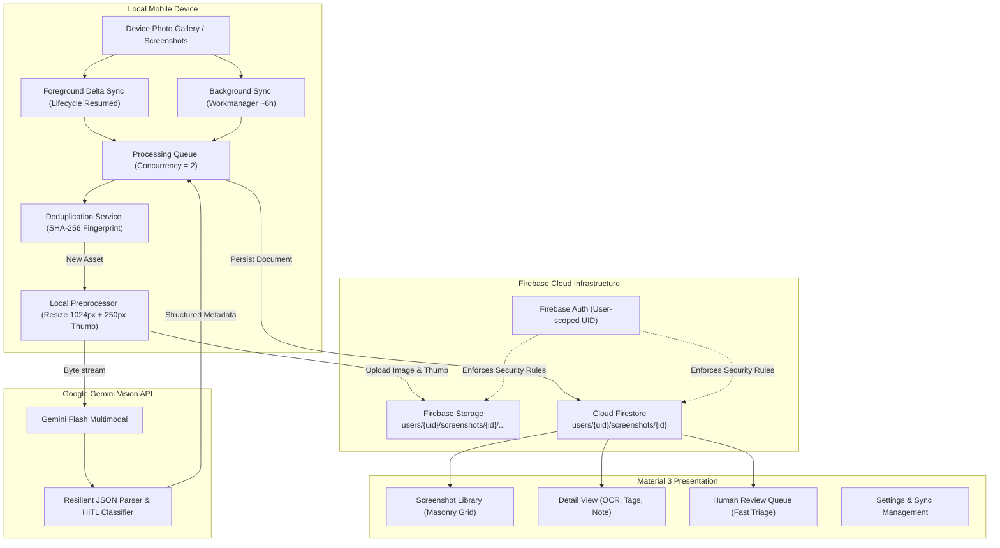

# Project Sift — Intelligent Screenshot Organization & Multimodal Vision

<p align="center">
  
</p>

<p align="center">
  <strong>Transforming cluttered mobile screenshot libraries into structured, searchable, AI-indexed knowledge.</strong>
</p>

<p align="center">
  <a href="#overview"></a>
  <a href="#overview"></a>
  <a href="#firebase"></a>
  <a href="#ai-pipeline"></a>
  <a href="#license"></a>
  <a href="#testing"></a>
</p>

---

## 📸 Overview

Every mobile user takes hundreds of screenshots: receipts, chat snippets, design inspirations, order confirmations, code snippets, travel bookings, and recipes. However, default gallery apps treat them as flat unorganized photos with no contextual intelligence, no full-text searchability, and zero categorization.

**Project Sift** solves this by establishing an autonomous, local-first, AI-driven ingestion and organization pipeline:
1. **Automated Detection & Delta Sync**: Listens for new screenshots in real time via foreground lifecycle hooks and battery-efficient background tasks (`Workmanager`).
2. **Local Preprocessing & Deduplication**: Cryptographically hashes thumbnails (SHA-256) to eliminate redundant uploads and downscales images (1024px max, Q60 JPEG + 250px thumbnail) to minimize bandwidth and storage.
3. **Multimodal AI Analysis**: Passes compressed screenshot bytes to Google Gemini multimodal vision models to extract titles, 15 canonical categories, searchable tags, full-text OCR, and contextual ambiguity flags.
4. **Human-in-the-Loop (HITL) Fast Triage**: Unambiguous screenshots are organized immediately. Subjective or low-confidence captures route to a fast-swipe review queue.
5. **Private & User-Isolated Cloud Storage**: All Firestore documents and Cloud Storage objects are locked strictly behind Firebase Authentication rules (`users/{userId}/*`).

---

## ✨ Key Features

- **⚡ Fast Masonry Library Grid**: Responsive multi-column layout (`flutter_staggered_grid_view`) with dynamic aspect ratios, category badges, and instant search filtering.
- **🏷️ 15 Canonical Categories**: Structured classification covering Finance, Shopping, Work, Communication, Travel, Food, Entertainment, Education, Technology, Health, Documents, Social, Reference, Aesthetic, and Other.
- **🔍 Full-Text OCR & Tag Search**: Client-side instant query filtering searching across generated titles, micro-tags, and raw extracted text in < 15ms.
- **🧠 Resilient AI Response Parser**: Handles partial JSON responses, markdown code fences, and repairs trailing commas while preserving HITL routing fallbacks.
- **🔄 Fast Swipe Review Queue**: Tinder-style triage deck allowing users to approve AI categorizations with a single swipe right, or adjust categories and tags with a tap.
- **🗑️ Bi-directional Deletion Reconciliation**: When a user purges a screenshot locally from their device photo gallery, Sift detects the missing asset and automatically garbage-collects associated cloud images and Firestore metadata.
- **🔋 Battery-Conscious Background Sync**: Periodically syncs new captures in the background (~6 hour schedule) respecting Android Doze mode and unmetered network constraints.

---

## 🏗️ Architecture & Dataflow



For full architectural blueprints, see [ARCHITECTURE.md](file:///Users/anujeshansh/AntiGravity%20IDE%20Projects/Sift/ARCHITECTURE.md).

---

## 🚀 Quickstart & Setup

### Prerequisites
- **Flutter SDK**: `>= 3.26.0` (Tested on Flutter 3.47.2 / Dart 3.7.2)
- **Android Studio / Xcode**: Android SDK Platform 34+, Android Gradle Plugin 8.11+, Gradle 8.14+
- **Firebase Project**: Firestore and Firebase Cloud Storage configured
- **Gemini API Key**: From [Google AI Studio](https://aistudio.google.com/)

### 1. Clone the Repository
```bash
git clone https://github.com/Anujesh-Ansh/Sift.git
cd Sift
```

### 2. Install Dependencies
```bash
flutter pub get
```

### 3. Configure Firebase
Download your `google-services.json` (Android) and `GoogleService-Info.plist` (iOS) from the Firebase Console and place them in:
- Android: `android/app/google-services.json`
- iOS: `ios/Runner/GoogleService-Info.plist`

Deploy the security rules and indexes:
```bash
firebase deploy --only firestore:rules,firestore:indexes,storage
```

### 4. Provide Gemini API Key
You can specify your Gemini API key in multiple ways:
- **At Runtime**: Enter your key directly in the in-app **Settings Screen**.
- **At Launch**: Pass `--dart-define=GEMINI_API_KEY=your_key_here` when launching:
  ```bash
  flutter run --dart-define=GEMINI_API_KEY=AIzaSy...
  ```

### 5. Run the Application
```bash
# Run on connected device or emulator
flutter run
```

---

## 🧪 Testing & Verification

Project Sift includes comprehensive unit, widget, and performance benchmark suites:

```bash
# Run all unit, widget, and performance tests
flutter test

# Run static analysis with zero lint warnings
flutter analyze

# Verify release/debug compilation
flutter build apk --debug
```

### Test Coverage Highlights
| Test Suite | File | Focus Area |
| :--- | :--- | :--- |
| **Stress & Performance** | `test/performance/large_library_stress_test.dart` | 1,000-item search benchmark (<50ms), 10,000-item dedup lookup (~40ms), memory disposal |
| **AI Parsing & Repair** | `test/unit/ai_response_parser_test.dart` | Markdown stripping, trailing comma repair, JSON recovery, HITL routing |
| **Category Classification** | `test/unit/category_classifier_test.dart` | Canonical taxonomy matching, fuzzy keyword fallbacks, case/whitespace trimming |
| **Deletion Reconciliation** | `test/unit/deletion_reconciliation_test.dart` | Device-to-cloud orphan cleanup, storage purging, dedup cache invalidation |
| **Background Sync** | `test/unit/background_sync_test.dart` | Workmanager task registration, battery/network constraint verification |
| **Widget UI** | `test/widget/screenshot_card_test.dart`, `review_queue_test.dart` | Masonry card rendering, badge layout, swipe triage gestures |

---

## 📂 Project Structure

```text
lib/
├── app/
│   ├── app.dart                          # Root MaterialApp & Riverpod ProviderScope
│   └── theme/                            # Material 3 dark/light themes & design tokens
├── core/
│   ├── constants/                        # Broad categories & system constants
│   ├── errors/                           # Domain exceptions & failures
│   └── logging/                          # Structured logging system
├── features/
│   ├── auth/                             # Firebase Auth repository & state
│   ├── screenshots/                      # Library, masonry grid, card, detail view
│   ├── review/                           # Fast-triage human review queue
│   ├── search/                           # Instant search filtering controller
│   └── settings/                         # Configuration, API keys, cache controls
└── infrastructure/
    ├── ai/                               # Gemini analyzer & resilient parser
    ├── background/                       # Workmanager background sync service
    ├── firebase/                         # Firestore & Storage wrappers
    └── media/                            # Media discovery, preprocessor, dedup, queue
```

---

## 🔒 Security & Privacy

Project Sift is engineered with a **local-first, privacy-by-design** approach:
- **Client-Side Compression**: Raw, uncompressed high-resolution images never leave the device.
- **Strict User Isolation**: Firebase Security Rules strictly verify `request.auth.uid == userId` for every read, write, and delete operation across both Firestore and Cloud Storage.
- **Automatic Deletion Sync**: Deleting a screenshot locally triggers automatic cloud purging on the next sync cycle.
- **No Third-Party Ad Tracking**: Zero telemetry or behavioral tracking SDKs.

See [PRIVACY.md](file:///Users/anujeshansh/AntiGravity%20IDE%20Projects/Sift/PRIVACY.md) and [FIREBASE.md](file:///Users/anujeshansh/AntiGravity%20IDE%20Projects/Sift/FIREBASE.md) for full compliance disclosures.

---

## 📚 Documentation Index

- 📘 [ARCHITECTURE.md](file:///Users/anujeshansh/AntiGravity%20IDE%20Projects/Sift/ARCHITECTURE.md) — Comprehensive system architecture & data pipeline
- 🛠️ [DEVELOPMENT.md](file:///Users/anujeshansh/AntiGravity%20IDE%20Projects/Sift/DEVELOPMENT.md) — Local development workflow & contributor guidelines
- 🔥 [FIREBASE.md](file:///Users/anujeshansh/AntiGravity%20IDE%20Projects/Sift/FIREBASE.md) — Firestore schema, indexing & Cloud Storage rules
- 🤖 [AI_PIPELINE.md](file:///Users/anujeshansh/AntiGravity%20IDE%20Projects/Sift/AI_PIPELINE.md) — Gemini prompt design, JSON schemas & HITL routing
- 🛡️ [PRIVACY.md](file:///Users/anujeshansh/AntiGravity%20IDE%20Projects/Sift/PRIVACY.md) — Privacy principles, local preprocessing & cloud security
